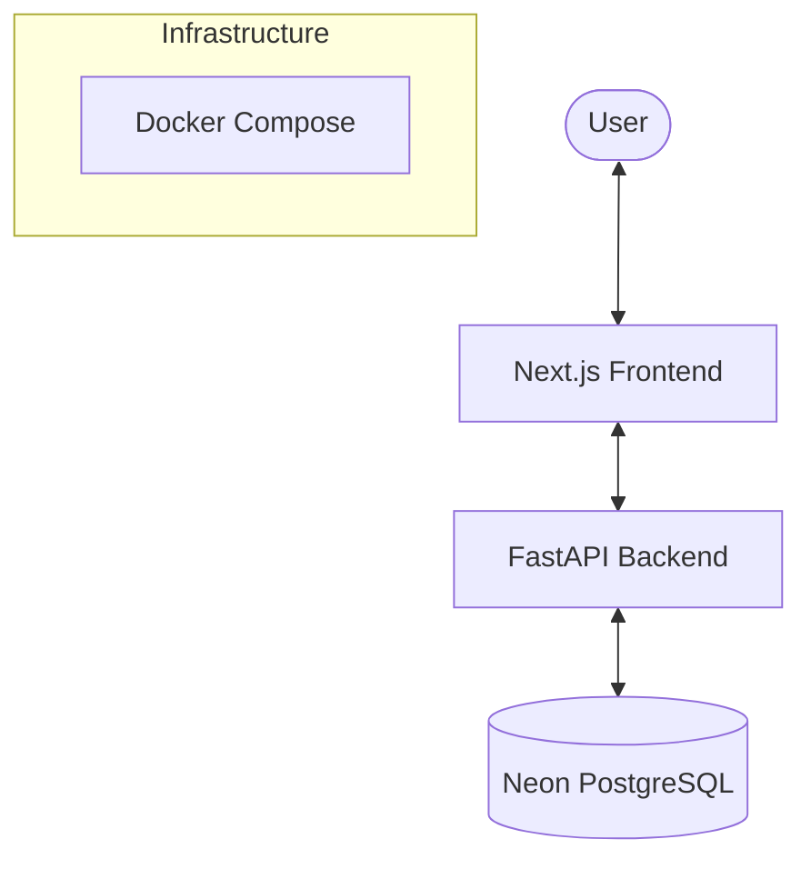

# Agentic AI Hackathon 2 - Todo App (Phase 2)

A modernized, full-stack version of the Todo Application, transitioning from a CLI tool to a robust web architecture.

## Architecture

The project follows a modern full-stack architecture with clear separation of concerns:



### Technology Stack

**Frontend:**
- **Framework:** [Next.js 15](https://nextjs.org/) (App Router)
- **Library:** [React 19](https://react.dev/)
- **Styling:** [Tailwind CSS 4](https://tailwindcss.com/)
- **UI Components:** [Shadcn/ui](https://ui.shadcn.com/) (Radix UI)
- **Data Fetching:** [TanStack Query v5](https://tanstack.com/query/latest)
- **Testing:** [Vitest](https://vitest.dev/) + [React Testing Library](https://testing-library.com/docs/react-testing-library/intro/)

**Backend:**
- **Framework:** [FastAPI](https://fastapi.tiangolo.com/)
- **Language:** [Python 3.13+](https://www.python.org/)
- **ORM:** [SQLModel](https://sqlmodel.tiangolo.com/) (SQLAlchemy + Pydantic)
- **Migrations:** [Alembic](https://alembic.sqlalchemy.org/)
- **Validation:** [Pydantic v2](https://docs.pydantic.dev/)
- **Testing:** [Pytest](https://docs.pytest.org/)

**Database & DevOps:**
- **Database:** [Neon PostgreSQL](https://neon.tech/) (Serverless)
- **Containerization:** [Docker](https://www.docker.com/) & [Docker Compose](https://docs.docker.com/compose/)
- **Package Managers:** [npm](https://www.npmjs.com/) (Frontend), [uv](https://github.com/astral-sh/uv) (Backend)

## Quick Start

The easiest way to run the application is using Docker Compose.

1. **Prerequisites**:
   - Docker & Docker Compose installed

2. **Setup Environment**:
   ```bash
   # Backend
   cp backend/.env.example backend/.env
   
   # Frontend
   cp frontend/.env.example frontend/.env.local
   ```
   *Note: You will need a valid `DATABASE_URL` for the backend to fully function.*

3. **Start the Application**:
   ```bash
   docker-compose up --build
   ```

4. **Access the Services**:
   - **Frontend**: http://localhost:3000
   - **Backend API**: http://localhost:8000
   - **API Docs**: http://localhost:8000/docs

## Development

For detailed local development instructions, see:

- [Backend Documentation](backend/README.md)
- [Frontend Documentation](frontend/README.md)

## Testing

Run tests for each service:

```bash
# Backend
cd backend && uv run pytest

# Frontend
cd frontend && npm test
```

## Code Quality

Automated checks are used to maintain code standards. It is recommended to run these before committing:

**Backend (Ruff, Black, Mypy):**
```bash
cd backend
uv run ruff check src/ tests/
uv run black src/ tests/
uv run mypy src/ tests/
```

**Frontend (ESLint, Prettier, TypeScript):**
```bash
cd frontend
npm run lint
npm run format
npm run type-check
```

## Development
